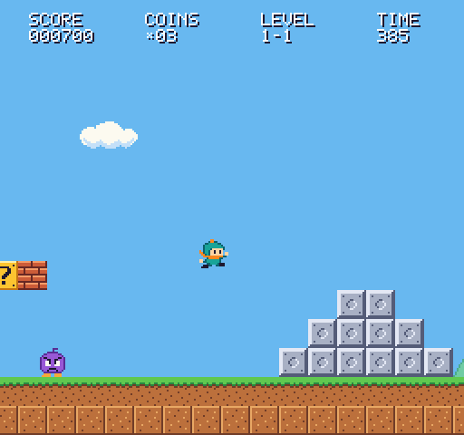
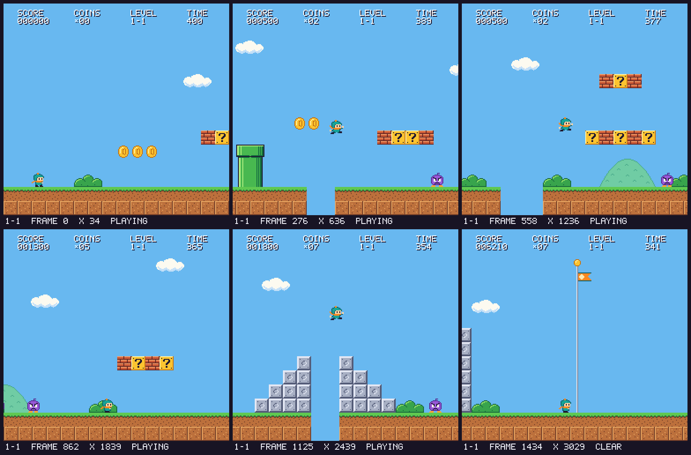

# mario-play

An original Mario-style platformer, a Gymnasium environment around it, and a
reinforcement-learning framework written from scratch in PyTorch (PPO and Double
DQN). PPO agents now complete level `1-1`. Our current research asks whether
frozen assessments from [Jev](https://docs.typesafe.ai/introduction) help PPO
learn faster.



Three layers, each usable on its own:

- **The game** (`mario_play.game`) - a deterministic, headless platformer in pure
  Python + numpy: run/jump physics, walkers and turtles, shells, ?-blocks,
  mushrooms, bricks, coins, pits, a timer and a flag. One renderer draws the
  256x240 frame into a numpy array; the pygame window only upscales that array,
  so an agent sees exactly what a human sees and training needs no display.
- **The environment** (`mario_play.envs`) - `MarioPlay-v0` for Gymnasium, with
  pixel observations or a compact `(14, 15, 16)` tile-grid observation, three
  nested action sets, a shaped and fully accountable reward, and baseline agents
  (random, heuristic, look-ahead search).
- **The RL framework** (`mario_play.rl`) - PPO and Double DQN behind one
  `Algorithm` interface, sync and subprocess vector envs with same-step
  auto-reset, a config-driven trainer with full-resume checkpoints, CSV +
  TensorBoard logging, evaluation and GIF/MP4 recording.

## Research results: Jev features + PPO

We trained matched PPO policies with zero auxiliary inputs, Jev assessments
refreshed every 16 decisions, and Jev assessments refreshed every decision.
Jev supplies four frozen state features; **PPO chooses every action and learns
from the original rewards**. This is an observation-augmentation experiment.


**Mario: all three final policies completed 20/20 sampled evaluations and the
separate greedy evaluation at 2M interactions each.** Baseline PPO first met
the predefined learning target at 600k interactions, versus 900k with frequent
Jev features and 1.1M with infrequent features. This single-seed, single-level
pilot did not show faster target attainment with Jev. Performance fluctuated
between checkpoints; these results do not establish general superiority or harm.

**Taxi: five paired seeds per condition, including an exact-rule feature control.**
All 15 policies learned to avoid illegal-action penalties but achieved zero
greedy deliveries from all 300 valid starts at every evaluated milestone through
200k interactions. That floor effect makes the comparison inconclusive about
delivery learning.

The [public research package](docs/research/README.md) includes learning curves,
matched gameplay, every evaluated milestone, per-episode data, and the frozen
Jev tables. The [Mario report](docs/jev-mario-extension-results.md),
[Taxi report](docs/taxi-jev-results.md), and
[learning-loop explanation](docs/jev-assisted-learning.md) describe the methods
and limitations. Full checkpoint archives remain local.

The tables required **476 Mario and 500 Taxi API requests**. Both assisted Mario
conditions shared one table; training reused cached outputs. More frequent
feature refreshes therefore do not mean more API requests. Jev was not fine-tuned.

## Framework verification

In addition to the research runs:

| Claim | Evidence |
|---|---|
| Game, env and framework behave as specified | 1,749 fast tests (`pytest -m "not slow"`, about a minute) |
| PPO and Double DQN learn | slow tests: both solve `CartPole-v1` from the shipped configs (PPO best eval >= 195, DQN >= 150) |
| Every bundled level can be finished | the look-ahead `SearchAgent` reaches the flag on `flat`, `1-1`, `1-2` and `1-3` |
| The whole pipeline runs end to end | short smoke runs: train -> checkpoint -> resume -> eval -> record, for PPO and DQN, grid and pixels |

The smoke runs only prove plumbing. For example, 30k steps of PPO on the `flat`
sanity level reach the flag in every episode - but `flat` has no obstacles, and a
policy that mostly presses right already finishes it.

Reference points from the non-learning baselines (`mario-play eval --agent ...`,
default reward, seed 10000):

| Level | Agent | Return | Progress | Outcome |
|---|---|---:|---:|---|
| `flat` | heuristic | 96.4 | 1.00 | flag |
| `1-1` | random (3 episodes) | 19.2 +/- 20.7 | 0.19 | died (enemy) |
| `1-1` | heuristic | 79.4 | 0.51 | died (pit) |
| `1-1` | search | 233.6 | 1.00 | flag |
| `1-2` | search | 237.3 | 1.00 | flag |
| `1-3` | search | 244.3 | 1.00 | flag |

The search agent plans by simulating future states on copies of the game, so
its result is a planning reference rather than a matched learning baseline.

## Quickstart

Requires [uv](https://docs.astral.sh/uv/) and Python >= 3.10 (3.11 is pinned in
`.python-version`; uv downloads it if needed).

```bash
git clone https://github.com/amandm/mario-play.git
cd mario-play
uv sync                                   # creates .venv with everything, dev tools included

uv run mario-play play                    # play level 1-1 yourself
uv run mario-play watch --agent search    # watch the look-ahead agent finish it
```

Keys: arrows / WASD move, Z / Space / Up / W jump, X / Shift run, R restart,
P pause, Esc quit.

## CLI tour

`mario-play` is also available as `python -m mario_play`. Every command has
`--help`. Exit codes: 0 success, 2 user error (one `error: ...` line, no
traceback), 130 training interrupted with Ctrl-C after `latest.pt` was saved.

```bash
uv run mario-play levels                                     # bundled levels: width, time, enemies
uv run mario-play play --level 1-2 --scale 3                 # keyboard play
uv run mario-play eval --agent heuristic --level flat --episodes 1
uv run mario-play eval --agent search --level 1-2 --episodes 1 --json
uv run mario-play watch --agent search --level 1-1
uv run mario-play record --agent search --level 1-1 --out search.gif --scale 2
uv run mario-play bench                                      # env steps/s on this machine
uv run mario-play bench --obs-mode pixels --n-envs 8 --vec subproc --steps 4000
uv run mario-play train --config configs/ppo_grid.yaml       # see "Training" below
```

| Command | What it does |
|---|---|
| `play` | Play a level with the keyboard (`--level`, `--scale`, `--fps`, `--max-frames`). |
| `train` | Train from a YAML config, or continue a run with `--resume`; trailing `key=value` arguments override config fields. |
| `eval` | Score a checkpoint (`--checkpoint`) or a baseline (`--agent random\|heuristic\|search`); `--episodes`, `--level`, `--seed`, `--max-steps`, `--stochastic`, `--device`, `--json`. |
| `watch` | The same players in a real-time window (`--scale`, `--episodes`). |
| `record` | The same players into a `.gif` (Pillow) or `.mp4` (needs the `video` extra: `uv sync --extra video`). |
| `bench` | Random-action throughput of one env and of a vec env (`--obs-mode`, `--n-envs`, `--vec`, `--steps`, `--level`). |
| `levels` | List the bundled levels. |

`--level` takes a bundled name (`flat`, `1-1`, `1-2`, `1-3`) or the path of a
level file. `--checkpoint` takes a `.pt` file or a run directory (meaning its
`checkpoints/latest.pt`).

## The environment

```python
import gymnasium as gym

import mario_play.envs  # registers MarioPlay-v0

env = gym.make("MarioPlay-v0", level="1-1", obs_mode="grid", stall_steps=150)
obs, info = env.reset(seed=0)
print(obs.shape, obs.dtype, env.action_space)  # (14, 15, 16) float32 Discrete(7)

done = False
while not done:
    obs, reward, terminated, truncated, info = env.step(env.action_space.sample())
    done = terminated or truncated
print(info["progress"], info["flag_get"], info["death_cause"])
```

`MarioEnv(level="1-1", obs_mode="pixels", action_set="simple", frame_skip=4,
reward=None, stall_steps=None, hud=True, render_mode=None)`. `level` may be a list:
one level is drawn per episode. One env step holds the action for `frame_skip`
game frames (the game runs at 60 frames per second, so 15 decisions per second).
The trainer builds its envs through `mario_play.envs.factory.make_env(EnvConfig)`,
whose defaults differ in one place: `EnvConfig.obs_mode` defaults to `"grid"`.

### Observations

| `obs_mode` | Bare env | As built by `make_env` / the trainer |
|---|---|---|
| `pixels` | `(240, 256, 3)` uint8 RGB frame | grayscale, resized to 84x84, last `frame_stack` frames stacked: `(4, 84, 84)` uint8 with the shipped configs |
| `grid` | `(14, 15, 16)` float32 in [-1, 1] | unchanged (stacked only if `frame_stack > 1`) |

The grid is a window of tiles, all 15 rows by 16 columns, horizontally egocentric:
the column holding the left edge of the player is always window column 4.
Columns outside the level read as solid.

| Plane | Name | Content |
|---:|---|---|
| 0 | `solid` | tiles that block movement |
| 1 | `breakable` | bricks and unused ?-blocks |
| 2 | `coin` | coin tiles |
| 3 | `enemy` | walkers, turtles, shells (not squished walkers) |
| 4 | `moving_shell` | kicked shells |
| 5 | `mushroom` | power-up |
| 6 | `goal` | the flagpole |
| 7 | `player` | the player's hitbox |
| 8 | `vx` | `vx / 2.5`, clipped to [-1, 1] (scalar, broadcast over the plane) |
| 9 | `vy` | `vy / 5`, clipped to [-1, 1] |
| 10 | `on_ground` | 0 / 1 |
| 11 | `big` | 0 / 1 |
| 12 | `x_offset` | `(x mod 16) / 16` |
| 13 | `time` | `time_left / level time` |

### Actions

The sets are nested, so an index keeps its meaning across sets. Default: `simple`.

| Index | Buttons | `right_only` (5) | `simple` (7) | `complex` (10) |
|---:|---|:---:|:---:|:---:|
| 0 | noop | x | x | x |
| 1 | right | x | x | x |
| 2 | right + jump | x | x | x |
| 3 | right + run | x | x | x |
| 4 | right + run + jump | x | x | x |
| 5 | jump | | x | x |
| 6 | left | | x | x |
| 7 | left + jump | | | x |
| 8 | left + run | | | x |
| 9 | left + run + jump | | | x |

Jumps are edge-triggered and variable-height: holding jump longer jumps higher,
and the button has to come up before the next jump.

### Reward

Per env step, summed over the skipped frames (`RewardConfig` defaults; override
any field through the `reward` dict, e.g. `env.reward.clip=5.0`):

| Component | Default | When |
|---|---:|---|
| `progress_weight` | `1/16` per pixel | change of x over the step: +1 per tile moved right, negative to the left |
| `time_penalty` | `-0.01` | every env step |
| `death_penalty` | `-15.0` | once, on the step the player dies (pit, enemy or timeout) |
| `flag_bonus` | `+50.0` | once, on the step the flag is reached |
| `coin_bonus` | `0.0` | per coin collected |
| `score_weight` | `0.0` | per point of game score gained |
| `clip` | `None` | symmetric clip of the step reward (the DQN configs use 5.0) |

### Episode end and info

`terminated`: the player died or reached the flag. `truncated`: `stall_steps`
consecutive env steps without a new furthest x (off by default; 150 in the Mario
configs), or `max_episode_steps` when set. `info` carries `x_pos`, `max_x`,
`progress` (0-1 toward the flag), `coins`, `score`, `time_left`, `flag_get`,
`death_cause` (`"pit"`, `"enemy"`, `"timeout"` or `None`) and `level`; finished
episodes also carry Gymnasium's `info["episode"]`.

## Training

The Jev experiments keep PPO as the learner and add frozen state assessments as
inputs. See the [longer Mario results](docs/jev-mario-extension-results.md) and the
[five-seed Taxi protocol](docs/taxi-jev-protocol.md) with its
[measured results](docs/taxi-jev-results.md). Curated data and media are in the
[public research package](docs/research/README.md); full checkpoints and working
run directories are kept in the ignored `runs/` directories.

Configs live in `configs/` and mirror the dataclasses in
[`src/mario_play/rl/config.py`](src/mario_play/rl/config.py) one to one (unknown
keys are rejected):

| Config | Algorithm | Observation | Meant for |
|---|---|---|---|
| `ppo_grid.yaml` | PPO | grid | the recommended start; fine on a laptop |
| `dqn_grid.yaml` | Double DQN (dueling) | grid | off-policy counterpart; replay needs ~2.7 GB RAM when full |
| `ppo_pixels.yaml` | PPO | pixels, 16 subprocess envs | a GPU |
| `dqn_pixels.yaml` | Double DQN (dueling) | pixels, 8 subprocess envs | a GPU and ~5.6 GB RAM for replay |
| `ppo_cartpole.yaml`, `dqn_cartpole.yaml` | both | `CartPole-v1` | algorithm-correctness checks (used by the slow tests) |

```bash
# A one-minute sanity run on the obstacle-free level:
uv run mario-play train --config configs/ppo_grid.yaml env.level=flat total_timesteps=30000 \
    log_interval=10000 eval.interval=10000 checkpoint_interval=10000 run_name=flat_smoke

# The real thing (5M steps; an hour or more on a recent laptop - size it with docs/training-guide.md):
uv run mario-play train --config configs/ppo_grid.yaml run_name=ppo_grid_1-1

# Any config field can be overridden with dotted key=value arguments (values are YAML;
# string fields keep their text, so run_name=2026-09-19 or run_name=007 name a run):
uv run mario-play train --config configs/ppo_grid.yaml ppo.lr=1e-4 "env.level=[1-1,1-2]" device=cpu
```

A run writes to `runs/<run_name>/` (default name: `<algo>_<env>_<timestamp>`; an
existing, non-empty run directory is never reused - a suffix `_2`, `_3`, ... is added):

```
runs/flat_smoke/
├── config.yaml            the resolved config
├── metrics.csv  log.txt   scalar metrics and the console lines
├── tb/                    TensorBoard events
└── checkpoints/
    ├── ckpt_<step>.pt     periodic + final checkpoints (the newest keep_checkpoints)
    ├── latest.pt          copy of the newest one; also written on Ctrl-C
    └── best.pt            best evaluation return so far
```

### Resume

```bash
uv run mario-play train --resume runs/flat_smoke total_timesteps=40000
```

`--resume` takes a run directory or a checkpoint file. The config stored in the
checkpoint is used unless `--config` is given as well; overrides apply last. The
run continues in the same directory: `global_step`, optimizer state, schedules
(learning rate, epsilon), RNG streams and the best evaluation score are restored
and the logs are appended to. A run that already reached `total_timesteps` has
nothing left to do, so raise it when resuming a finished run. Ctrl-C during
training finishes the current step, saves `latest.pt`, prints the resume command
and exits with code 130. Not restored: environments (they start new episodes) and
DQN's replay buffer (it refills) - see [docs/architecture.md](docs/architecture.md#checkpoints-and-resume).

### TensorBoard

```bash
uv run tensorboard --logdir runs
```

Scalars are grouped as `rollout/` (episode return and length, `flag_rate`,
`mean_progress` over the last 100 training episodes), `train/` (losses,
`approx_kl`, `clip_frac`, `explained_variance`, `entropy`, `q_mean`, `epsilon`,
`lr`), `eval/` and `time/` (`sps`). What to look for is described in
[docs/training-guide.md](docs/training-guide.md).

## Evaluate, watch, record

```bash
uv run mario-play eval --checkpoint runs/flat_smoke --episodes 2           # latest.pt of the run
uv run mario-play eval --checkpoint runs/flat_smoke/checkpoints/best.pt --level 1-1 --episodes 3 --stochastic
uv run mario-play watch --checkpoint runs/flat_smoke
uv run mario-play record --checkpoint runs/flat_smoke/checkpoints/best.pt --out policy.gif
```

A checkpoint carries its config, so the env (observation mode, action set, frame
skip, wrappers) is rebuilt exactly as trained; `--level` swaps the level. Policies
run on `--device cpu` unless told otherwise. The game is deterministic, so a
greedy policy plays the same episode every time on one level: use `--stochastic`
with several episodes to see the spread of the sampled policy. Episode `k` is
reset with `seed + k`, the same scheme the trainer's periodic evaluation uses, so
the numbers are comparable.

## Project layout

```
mario-play/
├── configs/                   training configs (YAML mirrors of rl/config.py)
├── docs/
│   ├── architecture.md        how the pieces fit, step order, checkpoints, extending
│   ├── training-guide.md      local / cloud training, sizing, hyperparameters, failure modes
│   └── superpowers/           the design spec and the implementation plan
├── scripts/render_preview.py  contact sheet of a level (PNG)
├── src/mario_play/
│   ├── game/                  constants tiles level entities physics engine | sprites font renderer | human
│   ├── levels/                flat.txt 1-1.txt 1-2.txt 1-3.txt (ASCII, one char per tile)
│   ├── envs/                  actions rewards observations mario_env wrappers factory
│   ├── agents/                random_agent heuristic_agent search_agent runner
│   ├── rl/                    config types utils vec_env networks logger checkpoint evaluate trainer
│   │   ├── algos/             base ppo dqn (+ registry)
│   │   └── buffers/           rollout replay
│   └── cli.py                 play | train | eval | watch | record | bench | levels
└── tests/                     game/ envs/ agents/ rl/ test_cli.py test_integration.py
```

Dependency direction: `game` <- `envs` <- `agents`; `rl` reaches the env only
through `envs.factory.make_env`; `cli` sits on top. More in
[docs/architecture.md](docs/architecture.md).

The gameplay images come from the game's renderer. The first static picture
is a single `env.render()` frame of the search agent's run on `1-1`, upscaled
2x; the research GIF records the trained PPO policies. The sheet below is
written by the preview script:

```bash
uv run python scripts/render_preview.py --level 1-1 --frames 6 --columns 3 --scale 2 --out docs/img/level-1-1.png
```



## Testing and linting

```bash
uv run pytest -m "not slow"     # fast suite: 1,749 tests, about a minute
uv run pytest -m slow           # ~1.5 min: CartPole convergence (PPO + DQN), search agent on 1-2 / 1-3, long fuzzing
uv run pytest                   # everything
uv run ruff check .
uv run ruff format --check .
```

Tests marked `slow` are the long-running proofs (algorithm convergence,
hard-level search, long fuzz campaigns); everything else stays fast and
deterministic. Tests never open a real window: `tests/conftest.py` selects SDL's
dummy video and audio drivers. CI (`.github/workflows/ci.yml`) runs ruff, the fast
suite on Python 3.10 and 3.12 with CPU-only torch, and the slow suite on 3.12.

## Original assets

This is a homage to a genre, not a port. The repository contains **no Nintendo
assets**: no ROMs, no sprites, no level layouts, no music. All pixel art (authored
as palette-indexed strings in `game/sprites.py`), the bitmap font and all four
levels are original, and the code uses neutral names throughout: `Player`,
`Walker`, `Turtle`, `Mushroom`. Please keep it that way in contributions.

## Licence

MIT - see [LICENSE](LICENSE).
