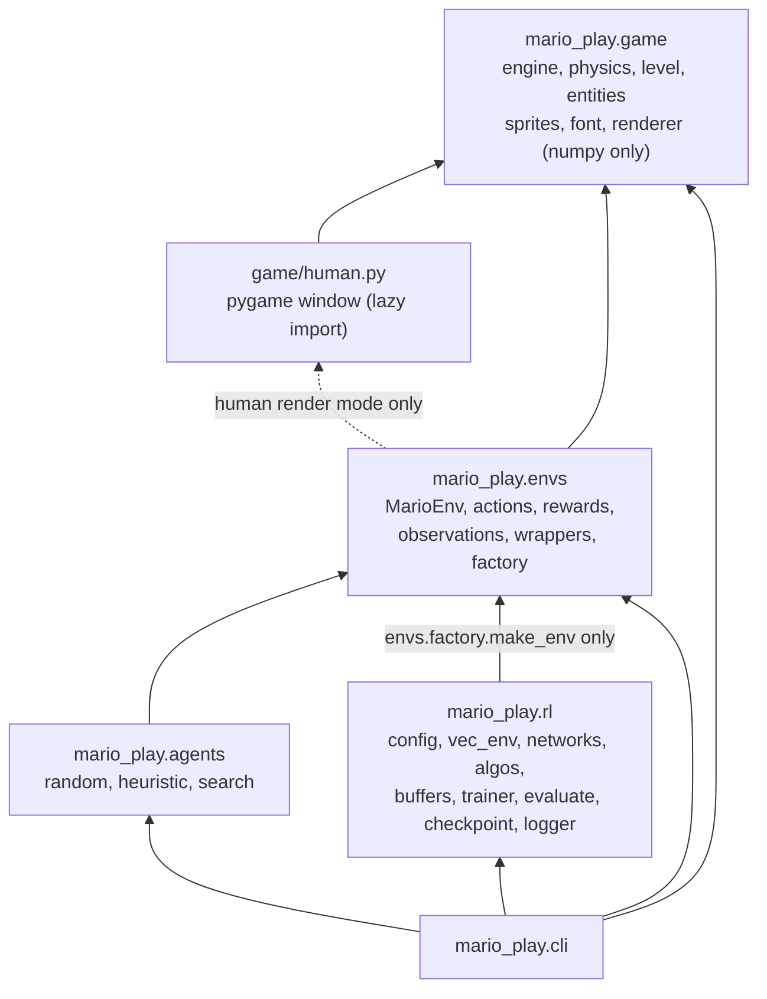
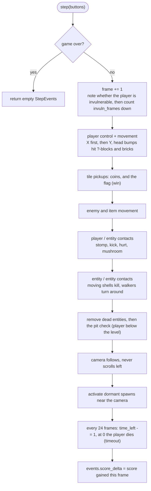
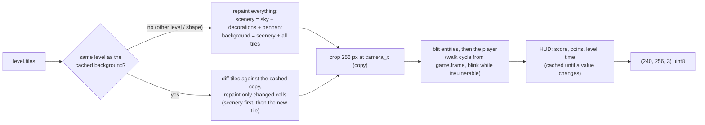
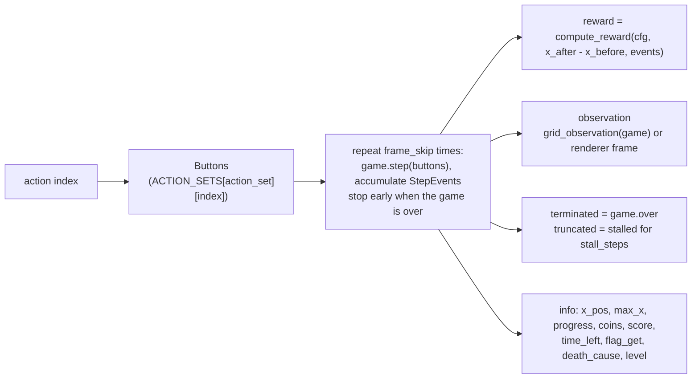
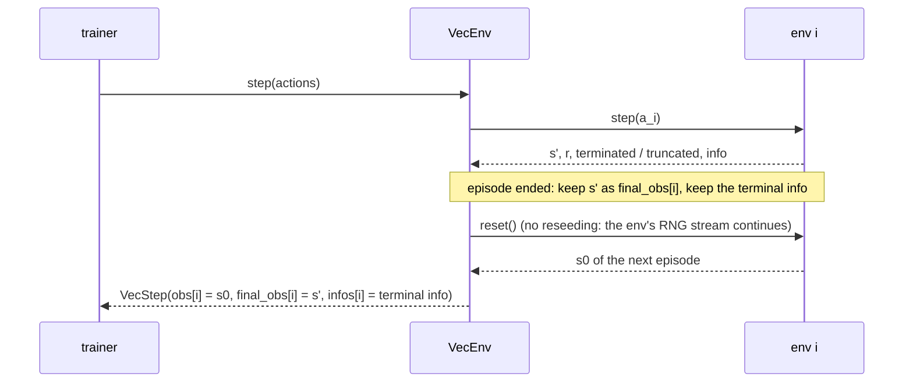
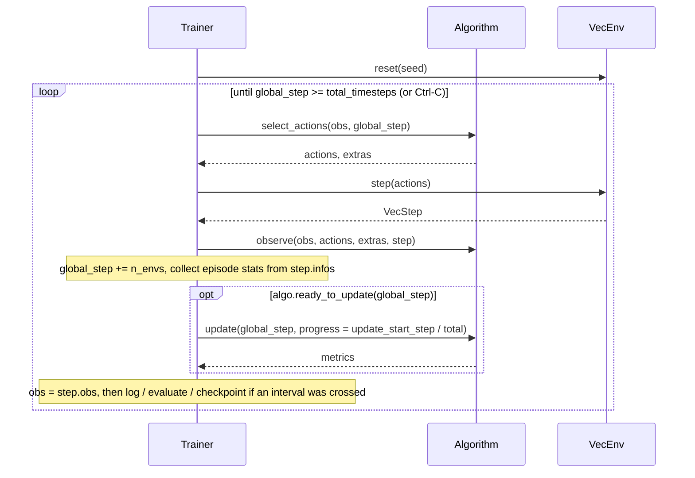

# Architecture

How mario-play is put together, as built. The design spec
([superpowers/specs/2026-09-19-mario-rl-design.md](superpowers/specs/2026-09-19-mario-rl-design.md))
says what was intended; where the two differ, this document and the code win.

- [Layers](#layers)
- [The game: one frame](#the-game-one-frame)
- [The renderer](#the-renderer)
- [The environment: translating the game into an MDP](#the-environment-translating-the-game-into-an-mdp)
- [Vector envs and `VecStep`](#vector-envs-and-vecstep)
- [The `Algorithm` interface and the trainer loop](#the-algorithm-interface-and-the-trainer-loop)
- [Checkpoints and resume](#checkpoints-and-resume)
- [How to add a level](#how-to-add-a-level)
- [How to add an algorithm](#how-to-add-an-algorithm)

## Layers



An arrow means "imports". The rules behind the picture:

- **`game` is headless and light.** It imports numpy and the standard library
  only - never gymnasium, torch or pygame. The single exception is
  `game/human.py`, which imports pygame lazily inside its functions. This is what
  lets a training worker simulate tens of thousands of steps per second without a
  display, and what lets `SearchAgent` clone games freely.
- **`envs` owns everything Gymnasium.** `rl` never touches `MarioEnv` directly: it
  asks `envs.factory.make_env(EnvConfig)` for a fully wrapped env. That is why the
  same trainer runs `CartPole-v1` (any id other than `MarioPlay-v0` goes through
  `gym.make`). `envs.factory` imports `rl.config` for the `EnvConfig` dataclass -
  plain data, no torch.
- **`rl/vec_env.py` stays free of torch.** It is imported by every subprocess
  worker; a worker that imports torch pays about a second and a couple of hundred
  MB for nothing.
- **`cli` imports nothing heavy at module level.** torch, gymnasium and pygame are
  imported inside the command handlers, so `--help` and `levels` answer at once.
- **Package `__init__.py` files are lazy contract files.** Import from concrete
  modules (`from mario_play.game.engine import Game`), never from package-level
  re-exports. `import mario_play.envs` has one side effect: it registers
  `MarioPlay-v0` with a string entry point.

## The game: one frame

Units: pixels and frames. A tile is 16 px, the view is 256x240 (16x15 tiles),
every level is 15 tiles tall, one `Game.step(buttons)` is 1/60 s, velocities are
px/frame. `x, y` of an entity is the top-left of its hitbox, +y is down.

`Game.step(buttons) -> StepEvents` runs in this order
([`game/engine.py`](../src/mario_play/game/engine.py)):



Things worth knowing:

- **Determinism.** The same level, seed and button sequence give the same
  `snapshot()` at every frame, also across `clone()`. The current rules draw no
  random numbers at all; `Game.rng` is the one source any future stochastic rule
  must use (never the global `random` / `numpy.random`).
- **`clone()`** is an independent deep copy. `SearchAgent` and
  `scripts/render_preview.py` plan on clones and only ever read the live game.
- **Collision** resolves X, then Y, against the tile grid (AABB), sub-stepped so
  that nothing tunnels through a tile at any speed. The left screen edge is a wall.
- **Jumps** are edge-triggered and variable-height: gravity is weaker while rising
  with jump held. A new jump needs the button released since the last one.
- **Enemies are dormant** until their spawn column comes within 384 px of the
  camera's left edge (half a screen before it scrolls into view).
- **Once over, `step` is a no-op** that returns empty events: `over`, `won` and
  `death_cause` (`"pit"`, `"enemy"`, `"timeout"`) say how it ended.

Levels are ASCII, one character per tile, parsed by `game/level.py` into a
`(15, width)` int8 tile array plus the player start, enemy spawns, time and flag
column. `Game` plays on a private copy of the level, because play rewrites tiles
(coins vanish, bricks break, ?-blocks become used).

## The renderer

One renderer produces the only picture there is: a new `(240, 256, 3)` uint8 RGB
array per call. Pixel observations, `render_mode="rgb_array"`, GIF recording and
the pygame windows (`play`, `watch`) all show this array; the windows merely
upscale it. `game/renderer.py`, `sprites.py` and `font.py` use numpy only.



Almost everything on screen is static, so the whole level is painted once into a
wide image and a frame is a crop plus a handful of sprite blits - well under a
millisecond on a laptop. The tile comparison is by content, not by object
identity, so one `Renderer` can be pointed at any game at any time: clones, a game
after `reset`, another level. Decorations (hills, bushes, clouds) are a pure
function of the level - no random state, the same picture in every process.
Sprites are original pixel art, authored as palette-indexed strings; alpha is
binary; `blit` clips at all four edges.

`MarioEnv` creates its renderer lazily: grid-mode training never constructs one
unless `render()` is called.

## The environment: translating the game into an MDP

[`envs/mario_env.py`](../src/mario_play/envs/mario_env.py) is the bare env;
[`envs/factory.py`](../src/mario_play/envs/factory.py) adds wrappers.



- **Actions.** `right_only` (5) is a prefix of `simple` (7), which is a prefix of
  `complex` (10); index 0 is always "no buttons". See the table in the
  [README](../README.md#actions).
- **Observations.** `pixels`: the renderer frame. `grid`: `(14, 15, 16)` float32
  planes in [-1, 1] built by `envs/observations.py` from one table lookup on a
  slice of `level.tiles` plus a few scalar writes - no renderer involved. The
  window is horizontally egocentric (player in window column 4) and columns
  outside the level read as solid. Eight spatial planes (solid, breakable, coin,
  enemy, moving shell, mushroom, goal, player), then six scalar planes broadcast
  over the grid (vx, vy, on_ground, big, sub-tile x offset, time fraction).
  Velocities are in the observation, so the grid needs no frame stacking.
- **Reward.** A weighted sum of the change of x over the step and the step's
  accumulated `StepEvents`; the time penalty is added once per env step whatever
  the frame skip, and `clip` bounds the total. The return of an episode can
  therefore be accounted for exactly: `progress_weight * (x_end - x_start) +
  time_penalty * steps + death_penalty * died + flag_bonus * won + ...`.
- **`terminated` vs `truncated`.** `terminated` means the MDP ended: death (pit,
  enemy, timeout - the game clock is part of the state, the `time` plane shows
  it) or the flag. `truncated` means the episode was cut off although the game
  could go on: `stall_steps` consecutive env steps without a new furthest x, or
  Gymnasium's `TimeLimit` when `max_episode_steps` is set. The distinction matters
  to the learners: a terminated transition has no future value, a truncated one
  does (see below).
- **Seeding.** `reset(seed=...)` seeds `np_random`, which draws the level (when
  several are configured) and the seed of the game's own RNG, so one seed pins
  down the episode.

`make_env(cfg, seed, render_mode)` builds, for `MarioPlay-v0`:
`MarioEnv` -> `TimeLimit` (if `max_episode_steps`) -> for pixels:
`GrayscaleResize` (Pillow, bilinear; `(H, W)` luma or `(3, H, W)` RGB) ->
`FrameStack` (always in pixel mode, so pixel observations are always `(C, H, W)`;
in grid mode only when `frame_stack > 1`) -> `RecordEpisodeStatistics` (finished
episodes carry `info["episode"] = {"r", "l", "t"}`). Both wrappers return new
arrays on every call, so observations can be stored without being overwritten.

Baseline agents (`mario_play.agents`) take the env, read `env.unwrapped.game` and
expose `act(obs) -> int` and `reset()`. `SearchAgent` steps clones exactly like
`MarioEnv.step` steps the live game, so a simulated plan is what the real env
will do.

## Vector envs and `VecStep`

`SyncVecEnv` steps its envs one after another in the training process;
`SubprocVecEnv` gives every env its own process (`multiprocessing` "spawn", so env
constructors must be picklable - `make_vec_env` uses
`functools.partial(make_env, cfg, seed + i)`). Worker exceptions surface in the
parent with their traceback; `close()` is idempotent and never hangs. Both
produce identical trajectories for the same seed and actions.

Both auto-reset **in the same step**: when an episode ends, the env is reset right
away and the returned observation already belongs to the next episode. The true
successor of the transition is kept separately:

```python
@dataclass
class VecStep:
    obs: np.ndarray         # (n, *obs_shape)  what the agent acts on next;
                            #                  for a finished env: FIRST obs of the NEW episode
    rewards: np.ndarray     # (n,) float32
    terminated: np.ndarray  # (n,) bool        the MDP ended: never bootstrap
    truncated: np.ndarray   # (n,) bool        cut off: bootstrap from final_obs
    final_obs: np.ndarray   # (n, *obs_shape)  true successor of this transition (== obs where not done)
    infos: list[dict]       # per env; the TERMINAL info for a finished env (with info["episode"])
    # .dones == terminated | truncated
```



Who uses what:

- **PPO** stores `dones = terminated | truncated` to cut the GAE recursion, and for
  envs with `truncated and not terminated` adds `gamma * V(final_obs)` to the
  stored reward - the value of the future that the cut-off hid.
- **DQN** stores `final_obs` as the successor and `terminated` alone as the done
  flag, so truncated transitions still bootstrap in the target.
- **The trainer** reads episode statistics (`info["episode"]`, `flag_get`,
  `progress`) from `infos` of finished envs.

`venv.reset(seed)` seeds env `i` with `seed + i`.

## The `Algorithm` interface and the trainer loop

Every learner implements [`rl/algos/base.py`](../src/mario_play/rl/algos/base.py):

| Method | Contract |
|---|---|
| `select_actions(obs, global_step) -> (actions, extras)` | exploratory actions for a batch; `extras` carries what `observe` needs (PPO: log-probs and values) |
| `observe(obs, actions, extras, step: VecStep)` | record the transitions (PPO: rollout buffer; DQN: replay buffer) |
| `ready_to_update(global_step) -> bool` | PPO: the rollout is full. DQN: `global_step >= learning_starts`, replay is warm (it holds `min(learning_starts, buffer_size)` transitions - this only bites after a resume), and every `train_freq` vector steps |
| `update(global_step, progress) -> dict[str, float]` | one learning update; `progress` in [0, 1] - the fraction of training done when this update's data began to be collected - drives schedules (PPO's LR anneal) |
| `predict(obs, deterministic=True) -> actions` | inference without side effects; all that evaluation uses |
| `state_dict()` / `load_state_dict()` | models, optimizers, counters - tensors and plain Python values only |

One loop drives on-policy and off-policy learners alike
([`rl/trainer.py`](../src/mario_play/rl/trainer.py)):



- `progress` is measured at the step where the data of an update began to be
  collected (`update_start_step`: the step of the previous update, or of the
  start / resume). PPO's update `i` of `N` therefore runs at
  `lr * (1 - (i - 1) / N)`: the first one at the configured rate, the last one
  at `lr / N` - never at exactly 0.
- `global_step` counts env transitions summed over all envs and grows by `n_envs`
  per vector step. Intervals (`log_interval`, `eval.interval`,
  `checkpoint_interval`) are rarely hit exactly, so each kind of work fires on the
  first step at or beyond the next multiple of its interval; all three fire at the
  end of training.
- **PPO** (`algos/ppo.py`, `buffers/rollout.py`): rollouts of `n_steps x n_envs`,
  GAE(lambda), clipped surrogate, optional clipped value loss, entropy bonus,
  advantage normalisation, minibatch epochs, grad-norm clipping, linear LR anneal,
  optional `target_kl` early stop. Metrics: `policy_loss`, `value_loss`, `loss`,
  `entropy`, `approx_kl`, `clip_frac`, `explained_variance`, `grad_norm`,
  `epochs`, `lr`.
- **DQN** (`algos/dqn.py`, `buffers/replay.py`): uniform replay that keeps the
  observation dtype (uint8 frames stay uint8), linear epsilon schedule on
  `global_step`, Double-DQN targets, optional dueling head, Huber loss, hard
  target syncs every `target_update_interval` transitions or Polyak averaging when
  `tau < 1`. Metrics: `loss`, `q_mean`, `grad_norm`, `epsilon`, `buffer_size`,
  `n_updates`.
- **Networks** (`rl/networks.py`): `build_encoder` picks `NatureCNN` for uint8
  `(C, H, W)` images (scaled by 1/255 inside the encoder), `GridEncoder` for float
  `(C, H, W)` grids and `MLPEncoder` for vectors; flatten sizes come from a dummy
  forward pass. Orthogonal init (sqrt(2) hidden, 0.01 policy head, 1.0 value / Q
  heads). Everything is float32 - MPS has no float64.
- **Evaluation** (`rl/evaluate.py`) builds its own env from the `EnvConfig`, never
  the training envs, and resets episode `k` with `eval.seed + k`, so scores are
  comparable across a run. The trainer saves and restores the global RNG streams
  around it, so training is identical however often it is evaluated. A new best
  `mean_return` writes `best.pt`.
- **Logging** (`rl/logger.py`): console + `log.txt`, `metrics.csv` (columns grow as
  new keys appear) and TensorBoard under `tb/`. Rollout statistics are means over
  the last 100 finished training episodes.
- **Ctrl-C**: the first SIGINT finishes the current step, saves `latest.pt` and
  returns normally (the CLI exits with 130); a second one raises
  `KeyboardInterrupt` right away.

## Checkpoints and resume

A checkpoint ([`rl/checkpoint.py`](../src/mario_play/rl/checkpoint.py)) is one
`torch.save` file:

| Key | Content |
|---|---|
| `format_version` | 1 |
| `algo_name` | `"ppo"` / `"dqn"` |
| `algo_state` | PPO: `model`, `optimizer`, `n_updates`. DQN: `q_net`, `target_net`, `optimizer`, `vector_steps`, `n_updates`, `last_target_sync`, exploration `rng` |
| `config` | the full `TrainConfig` as a nested dict - a checkpoint alone is enough to rebuild env and policy (`load_algorithm`) |
| `global_step`, `best_eval` | counters |
| `rng_state` | Python, numpy and torch (+ CUDA) generator states |
| `extra` | `episodes` finished so far, `elapsed` seconds |

It contains only tensors and plain Python containers / primitives, so it loads
with `torch.load(weights_only=True)`: **loading a checkpoint never executes
pickled code**. `save_checkpoint` validates the payload before touching the disk
(a value `weights_only` would refuse raises `TypeError` naming its location) and
writes atomically (temp file, fsync, rename). `ckpt_<step>.pt` files are rotated
down to `keep_checkpoints`; `latest.pt` and `best.pt` are never rotated away.
`load_checkpoint` raises `FileNotFoundError` for a missing file and `ValueError`
(naming the file, with the reader's own exception chained) for anything that is
not a readable checkpoint: a corrupt, truncated or foreign file, or a pickle that
needs arbitrary objects.

**Resume guarantees.** `Trainer(cfg, resume=path)` (CLI: `train --resume`) restores
the algorithm (weights, optimizer moments, update counters), `global_step` - and
with it the LR anneal and the epsilon schedule, which are functions of
`global_step` -, the best evaluation score, the episode counter and the global RNG
streams. A checkpoint that lives in `<run>/checkpoints/` continues *that* run:
same directory, `metrics.csv`, `log.txt` and TensorBoard appended. A loose
checkpoint file starts a new run directory. The passed config stays authoritative
(raise `total_timesteps` to train longer, change `dqn.lr`, ...); without one the
stored config is used. The algorithm must match the checkpoint's. Resuming from
an older numbered checkpoint renames the later ones to `*.superseded.pt` - nothing
is deleted. The same holds for a `best.pt` and a `latest.pt` from beyond the
resumed step: `best.pt` is renamed (after a crash it can be newer than
`latest.pt`, whose stored best score would otherwise let a worse "new best"
overwrite it), and `latest.pt` is kept as `latest.superseded.pt` while a copy of
the resumed checkpoint takes its place at once, so `--resume <run_dir>` never
jumps back into the abandoned timeline.

**Resume limits.**

- **The replay buffer is not saved.** It can be gigabytes; after a resume DQN
  starts with an empty buffer, keeps acting with the restored epsilon and does not
  update until replay again holds as many transitions as a fresh run starts
  learning with (`min(learning_starts, buffer_size)`, at least one batch). Those
  steps count toward `total_timesteps`.
- **Environments restart.** Episodes in flight are lost; the envs are reset with
  `seed + global_step`, so the resumed run does not replay the run's first
  episodes. PPO's partially collected rollout is discarded and recollected.
- Hence a resumed run is *not* bit-identical to an uninterrupted one. It is a
  statistically equivalent continuation.
- `best.pt` is the best **evaluation** `mean_return`; with `eval.interval=0`
  periodic evaluation is off and only the final evaluation can write it.

## How to add a level

1. Write an ASCII file, one character per tile, at most 15 rows (shorter levels
   are padded with empty rows on top), at least 16 columns:

   | char | meaning | char | meaning |
   |---|---|---|---|
   | ` ` `.` | empty | `o` | coin |
   | `#` | ground | `[` `]` | pipe left / right half (the top lip is detected) |
   | `X` | hard block | `g` | walker spawn |
   | `B` | brick | `k` | turtle spawn |
   | `?` | ?-block with a coin | `S` | player start (the tile the feet occupy) |
   | `M` | ?-block with a mushroom | `F` | flagpole (the topmost `F` becomes the flag top) |

   Lines starting with `;` are comments; `; time=300` sets the clock. Parsing
   errors name line and column. Look at
   [`src/mario_play/levels/1-1.txt`](../src/mario_play/levels/1-1.txt) for the
   conventions (intent header, column ruler).
2. Try it - every `--level` option and `env.level` accept a file path:

   ```bash
   uv run mario-play play --level path/to/my-level.txt
   uv run mario-play eval --agent search --level path/to/my-level.txt --episodes 1
   uv run python scripts/render_preview.py --level path/to/my-level.txt --out preview.png
   ```

   The search agent reaching the flag is the completability proof. Design rules
   the bundled levels follow: no corridor that needs a 1-tile-high gap (there is
   no crouch), pits at most 4 tiles wide, room to run up before wide pits, nothing
   in the two top tile rows (the HUD is written over them).
3. To bundle it, drop the file into `src/mario_play/levels/` (every `*.txt` there
   is listed by `list_levels()`), add its name to the expected list in
   `tests/game/test_level.py` and to the completability tests in
   `tests/agents/test_agents.py`, and keep the layout original.

## How to add an algorithm

1. Add a hyperparameter dataclass to `rl/config.py` and a field for it on
   `TrainConfig` (YAML keys and `key=value` overrides follow automatically;
   unknown keys are rejected).
2. Implement `rl/algos/<name>.py` as a subclass of `Algorithm`. Keep to the
   contract above, and in particular:
   - use `step.final_obs` / `step.terminated` / `step.truncated` correctly -
     `step.obs` of a finished env belongs to the next episode;
   - keep every tensor float32 and move observations with `self.obs_to_tensor`
     (encoders scale uint8 images themselves);
   - `state_dict()` must hold tensors and plain Python values only, or
     `save_checkpoint` will refuse it;
   - hold networks as attributes (`nn.Module`), which is how the trainer counts
     parameters; build encoders with `rl.networks.build_encoder`;
   - `predict` must not touch training state.
3. Register it in `rl/algos/__init__.py` (`ALGORITHMS` and the lazy import in
   `get_algorithm`).
4. Test it the way PPO and DQN are tested: unit tests against hand-computed
   targets, a `state_dict` round-trip, a fast sanity run in `tests/rl/`, and a
   `@pytest.mark.slow` CartPole convergence test with a shipped config.
