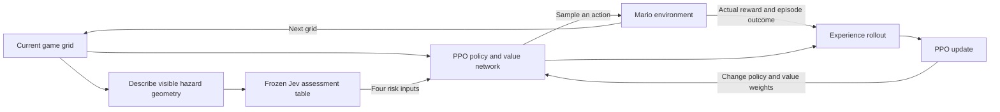

# What learns in the Jev-assisted Mario experiment?

The **PPO policy network learns**. Jev stays fixed and supplies four extra inputs:
estimated danger from enemies, obstacles, gaps, and overhead blocks. This is a
PPO variant with augmented observations, not a new reinforcement-learning
optimizer and not a fine-tuned Jev model.

The network receives the original 14-channel tile grid plus four broadcast
risk planes. It predicts probabilities for seven controller actions and a
value estimate: how much future reward it expects from the current situation.
During training it samples an action, so it can explore alternatives.

The game gives the normal reward for progress, time, death, or reaching the
flag. Jev does not replace this reward. PPO compares the observed return with
its value estimate. Actions followed by better-than-expected outcomes tend
to become more likely; worse-than-expected ones tend to become less likely.
PPO clips its policy objective to discourage excessively large policy changes
in a single update. The value prediction is trained alongside the policy.

Nothing forces the policy to obey Jev. It can learn to use, ignore, or misuse
the extra inputs. A risk estimate is information, not an instruction to jump.

## What an iteration means here

One **interaction** means one action and resulting environment transition in
one game instance. Each action advances up to four simulation frames. Eight
games run in the vector environment.

One **PPO update** follows a rollout of 128 decisions from each of those eight
games: 1,024 interactions. PPO makes four passes over that rollout, split into
four minibatches per pass. Thus one PPO update contains 16 optimizer steps.
A 100,000-interaction milestone contains 97 completed PPO updates and a partial
rollout; the partial rollout continues into the next stage.

This distinction matters: a claim of fewer iterations must say whether it
means fewer game interactions, PPO updates, optimizer steps, or seconds.

## How the frequency comparison works

All three policies begin with identical weights and have the same network size.
The control receives four zeros. One assisted policy refreshes its four Jev
inputs every 16 actions; the other refreshes them every action. Both refresh
when an episode resets. The original game grid always updates normally.

The slower-refresh policy therefore sometimes acts using stale advice. The
question is whether fresher advice makes reward-based learning easier. It
could also distract the policy or create a shortcut that fails later.

The finite table stores 476 actual Jev responses prepared before training.
Each refresh retrieves four matching assessments locally. Increasing refresh
frequency increases access to advice, **not physical API requests**. This
experiment cannot prove that sending more duplicate requests improves learning.

We evaluate each policy after every 100,000 interactions using the same fixed
evaluation seeds. The target is at least 12 completions in 20 sampled episodes
and one completion with the greedy policy, which always chooses its most likely
action. The learning curve includes every checkpoint, including regressions.

See [the fixed protocol](jev-assisted-experiment.md) for the comparison's
limitations and [the report generator](../scripts/report_jev_assisted.py) for
how the saved evaluations are summarized.
