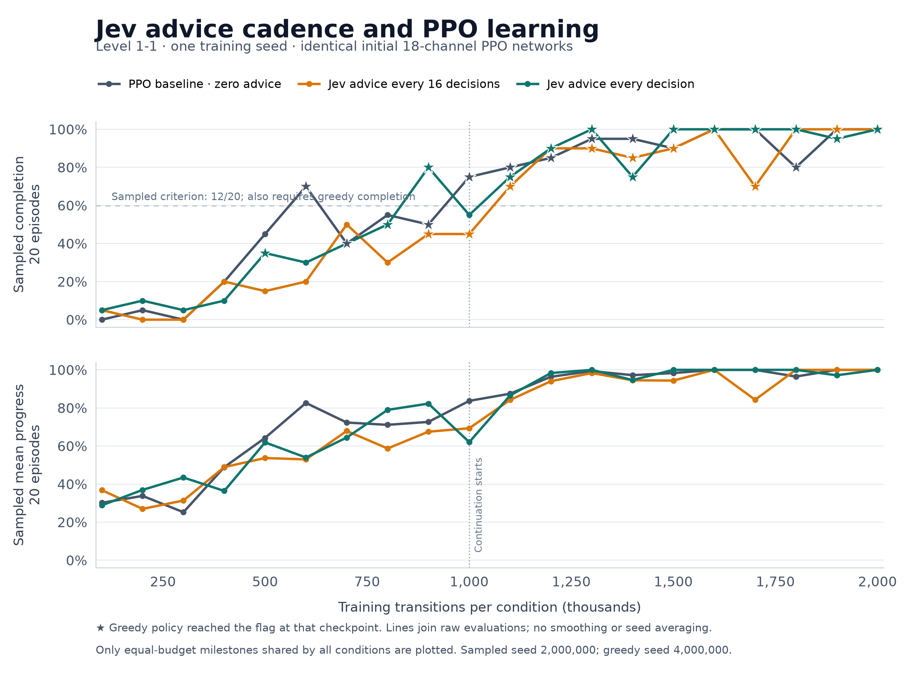
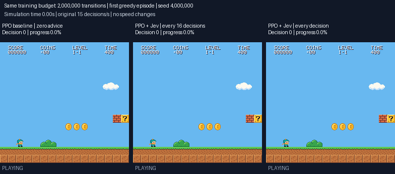
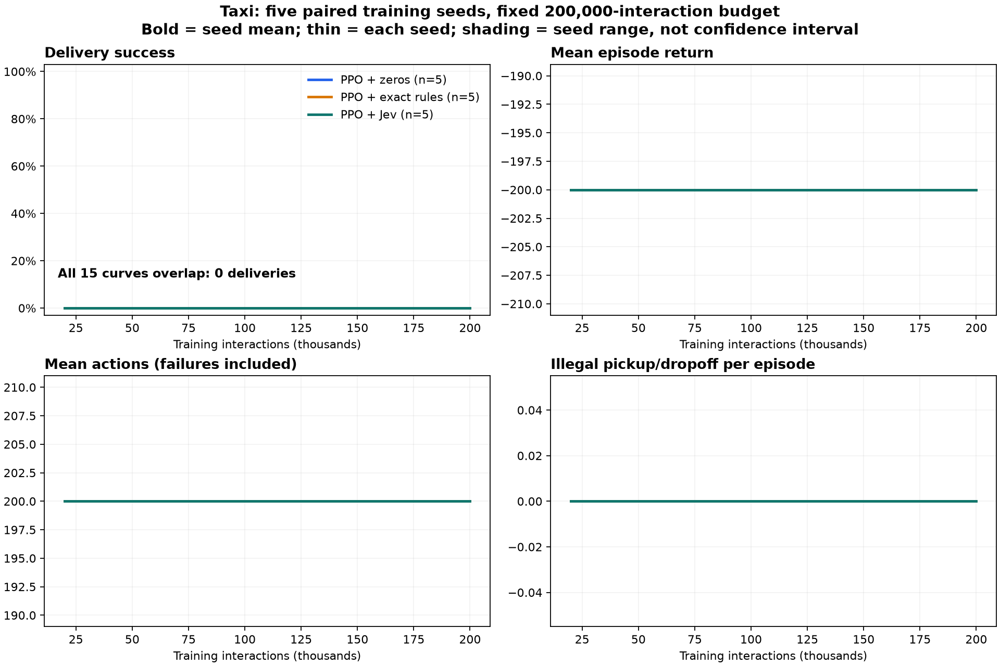
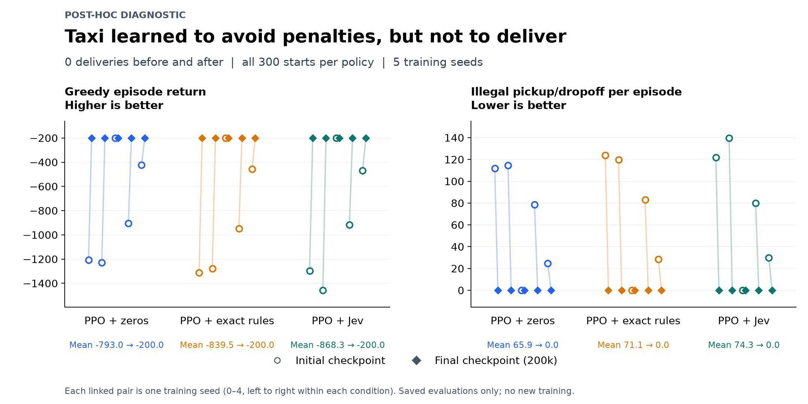
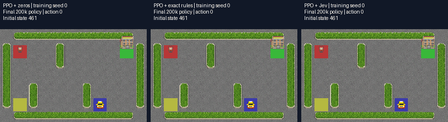

# Can frozen Jev features help PPO learn faster?

This is an exploratory research and learning project. We tested **PPO with
Jev-derived observations** in an original Mario-style platform game and
Gymnasium Taxi. PPO chooses every action and learns from each environment's
unchanged rewards. Jev supplies four additional observation features; it is
neither fine-tuned nor used to supply expert actions.

**The tested integration did not demonstrate faster learning.** The platform
game learned successfully in all three conditions, with baseline PPO reaching
the predefined target first. The Taxi comparison is inconclusive because no
condition learned deliveries within the fixed budget.

## Platform game: successful policies, no demonstrated training speedup

All policies started with identical weights, trained on level `1-1`, and used
the same 18-channel network. The baseline's four auxiliary planes are zero;
the other conditions receive frozen Jev risk probabilities refreshed every
16 decisions or every decision. The original game, artwork and levels are
implemented in this repository; this experiment does not use a Nintendo ROM.

| PPO observations | First target crossing | Final sampled completions | Final greedy completion |
| --- | ---: | ---: | --- |
| Grid + zeros | 600,000 interactions | 20/20 | Yes |
| Grid + Jev every 16 decisions | 1,100,000 interactions | 20/20 | Yes |
| Grid + Jev every decision | 900,000 interactions | 20/20 | Yes |

The target requires **at least 12/20 sampled completions and a greedy
completion at the same checkpoint**. Every condition finished at **2 million
interactions**, with 1,952 completed PPO updates. The run continued from each
latest 1-million-interaction checkpoint, preserving its optimizer and random
state. Restarting environments discarded 576 incomplete-rollout transitions
equally per condition. The learning-rate annealing horizon stayed at 5 million.

The curves include regressions. These are **one training seed, one level and
reused evaluation seeds**, not independent replications or held-out
generalization. Earlier threshold crossing in this pilot cannot establish a
reliable general advantage or disadvantage for Jev.

This clip uses the final 2-million-interaction policies, the same greedy seed
and aligned simulator decisions. Completed episodes hold their final frame
with an explicit label. Baseline, infrequent Jev and frequent Jev finish in
314, 312 and 303 decisions respectively; **episode length measures gameplay,
not how quickly a policy learned**. The GIF is copied unchanged from the
recording. Full [continuation protocol](../jev-mario-extension.md) and
[result discussion](../jev-mario-extension-results.md).

## Taxi: penalty avoidance improved, deliveries stayed at zero

We ran **five paired training seeds** with three conditions: zero auxiliary
values, exact-rule values and Jev probabilities. Each condition gets the same
decoded state and map information, plus four auxiliary values, through a
64 × 64 MLP. Initial weights match within each seed. Actions are unmasked and
rewards unchanged. Each run trains for 200,000 interactions; all 15 runs
together collect 3 million interactions.

Every 20,000 interactions, the greedy policy is evaluated from **all 300 valid
initial states**, with a 200-decision limit. **Every one of the 150 evaluated
policies completed 0/300 deliveries.** Their returns were −200 and illegal
pickup/dropoff counts were zero. Normalized success AUC over 20k–200k is zero
for every seed and condition. This floor effect does not establish equivalence
or determine whether Jev could help a working delivery learner.

A separately labeled **post-hoc diagnostic** evaluates the saved untrained
policies on the same 300 starts. It is excluded from the primary AUC.

| Condition | Mean initial return | Mean final return | Initial illegal actions/episode | Final illegal actions/episode |
| --- | ---: | ---: | ---: | ---: |
| Zeros | −793.04 | −200 | 65.89 | 0 |
| Exact rules | −839.48 | −200 | 71.05 | 0 |
| Jev | −868.33 | −200 | 74.26 | 0 |

Delivery success is zero before and after training. The observed change
supports learning to avoid penalties, without learning to deliver passengers.
The exact-rule condition also failed, so inaccuracies in Jev's auxiliary
features alone cannot explain this result.

Left: zeros; middle: exact rules; right: Jev. This is a retained failure from
one of the three starts selected before training, using the final seed-0
policies. All **201 source frames**, original 916 × 251 dimensions and **30.15
seconds of timing** are preserved. A shared 128-color palette compresses the
GIF; no actions, frames or episode outcomes were removed. Full
[protocol](../taxi-jev-protocol.md) and [results](../taxi-jev-results.md).

## Actual API calls and cached feature refreshes

The shared platform-game table used **476 actual Jev API calls**; Taxi used
**500 actual calls**, all with `jev-1.13.0`. Training and evaluation use those
frozen tables and make **zero further API calls**. Millions of cached lookups
are not millions of requests. This experiment tests feature integration and
refresh cadence; it cannot establish that increasing live API call volume
causes faster learning.

The platform-game features assess enemy contact, a forward obstacle, a visible
gap and overhead clearance using bucketed current observations. Taxi assesses
pickup readiness, dropoff readiness, proximity to the current goal and a
same-row blocked route. The exact requests and responses are included in the
tables, so the feature definitions can be inspected and reused without new
API calls. Geometry extraction is engineered; improvements cannot be
attributed to Jev reasoning alone.

## Downloadable evidence and reproduction

| File | Contents |
| --- | --- |
| [Platform-game milestones](mario-milestones.csv) | All 60 evaluations, aggregate metrics, counters and checkpoint hashes |
| [Platform-game episodes](mario-episodes.csv) | All 1,260 sampled and greedy evaluation episodes |
| [Taxi milestones](taxi-milestones.csv) | All 150 evaluations across conditions and seeds |
| [Taxi episodes](taxi-episodes.csv) | All 45,000 per-start milestone outcomes |
| [Taxi initial diagnostic](taxi-initial-diagnostic.csv) | All 15 initial-to-final comparisons, with initialization hashes |
| [Taxi initial episodes](taxi-initial-episodes.csv) | All 4,500 initial-policy diagnostic episodes |
| [Taxi feature diagnostics](taxi-feature-diagnostics.json) | Full confusion counts and feature precision/recall at a diagnostic 0.5 threshold |
| [Platform-game Jev table](mario-jev-table.json) | Exact 476-case table used during training |
| [Taxi Jev table](taxi-jev-table.json) | Exact four-feature probabilities for all 500 states |
| [Experiment settings](experiment-settings.json) | Architecture, PPO settings, seeds, evaluation, continuation and playback provenance |
| [Training source hashes](source-hashes.json) | Source-file versions recorded for the original runs |
| [Manifest](manifest.json) | SHA-256 hashes, sizes and local input provenance |
| [Artifact exporter](export_artifacts.py) | Explicit numerical field selection and GIF transformation, with coverage assertions |

These CSVs support independent recomputation of the displayed outcome metrics.
`ppo_updates_kind` marks older platform-game update counts estimated from
interaction totals; resumed-run counters are recorded directly. Booleans in
CSVs are `True`/`False`. The Taxi initial diagnostic is post-hoc and must not be
silently added to the predefined AUC interval.

The tables retain their original byte hashes:

- Platform game: `17c7a4e845295a77d79c561d665223cc267e87c07e757da85f02199f8d245ca4`
- Taxi: `339d8a4092fe5d7d906bbe8a69f668ec4ee31b58477252116630dee052c5637d`

For training, use the repository's experiment scripts and pass these table
paths instead of rebuilding their caches. The linked protocols document the
run configuration. The exporter can rebuild this package when the original
local `runs/` archives are available. The public package includes evaluation
data, tables and source provenance; model checkpoint bytes and the complete
local run archives are not included. Training-source hashes describe the code
at execution time; subsequent reporting changes are distinct from retraining.
